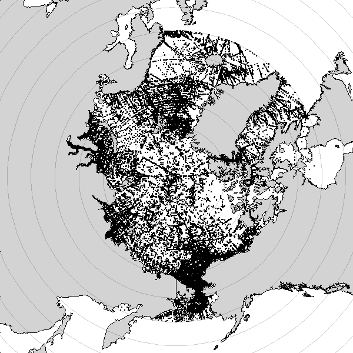

## ARCTIC GEOCHEMICAL ATLAS HISTORY

The Geochemical Atlas was compiled to permit pan-Artcic analysis of changes in biogeochemical properties; it was originally published with Polyakov et al., 2020 as a description in the supplement. The files included as the "original upload" include a .mat data file, a document describing the quality control measures taken during compilation of the data sets, and a .txt file with all data in a tabular format. This work was conducted by Matthew Alkire, Kristina Brown, and Igor Polyakov.  

Polyakov, I.V., Alkire, M.B., Bluhm, B.A., Brown, K.A., Carmack, E.C., Chieric, M. Danielson, S.L., Ellingsen, I., Ershova, E.A., Gårdfeldt, K., Ingvaldsen, R.B., Pnyushkov, A.V. Slagstad, D., Wassmann, P. (2020). Borealization of the Arctic Ocean in Response to Anomalous Advection From Sub-Arctic Seas. *Frontiers in Marine Science*, 7. https://doi.org/10.3389/fmars.2020.00491
Front. Mar. Sci. , 02 July 2020

This original data set stops in 2018. The subsequent versions have been updated by Laura Whitmore. 

## Data Quality Control 

The data in this compilation were curated from several sources and analytical approaches. Data went through the following steps of QA/QC to be included in the data file (see pdf for more detail): 
(1) Apply quality flags based on "reasonable ranges" for parameters.
(2) Visually inspect data: vertical profiles -- this is the most subjective step of QC. Any data point with a "large" separation from the cloud of data at a depth bin is flagged and considered for removal from the combined data set. 
(3) Define "acceptable" concentrations for each region of th Arctic; data outside +/- 3 SD of the mean for parameter are flagged and removed from the combined data set. 

For all data sets, any removed or flagged data are articulated in the QA/QC pdf. 

Blank cells/no-data are indicated in the txt with -9999.

The quality flag schema used is as follows: 
Quality flags 0, 1 and 2 usually indicate good data; quality flag of 6 typically denotes an average value.  All other flags indicate missing (= 9), bad (= 4) or questionable (= 3) data.  
However, the final data set does not include flags as all data is presumed "good." 

## Locations of Data 



how many entries, stations, flags. 

## Downloadable data types and how to read them 

The original .mat file can be readily loaded into matlab or read into R using the library R.matlab. 

The .txt file is headerless, but can be read: 

Into Matlab:


``` matlab
readf,1,iyr,imo,ida,sla,slo,p,t,s,o2,sd,o2d,po4,ni,si,dic,ta,d18o,idc,ids1,ids2,npr,pno,no,po,o2sat,po2sat,fpw,sim,mw,pac,aw   ; v4.3
```

Headers for columns of the txt are as follows: 
(1) Year (2) Month (3) Day (4) Latitude (5) Longitude (6) Pressure (7) Temperature (8) Salinity (primary) (9) Dissolved oxygen (primary) (10) Bottle salt (ignore) (11) Bottle O2 (ignore) (12) Phosphate (13) Nitrate+nitrite (14) Silicate (15) DIC (16) TA (17) d18O (18) Cruise ID (19) Station ID (20) Station ID_new (21) N:P ratio (22) pNO3 (23) NO (24) PO (25) O2sat (26) pO2sat (27) fPAC (28) SIM
(29) MW (30) PAC (31) ATL

Into R: download txt and identify the filepath on your computer.

```R

atlas = read.csv(file = '/insertfilepath/Pan_Arctic_geochem_v4.txt', sep = ' ', header = F)

colnames(atlas) = c('Year', 'Month', 'Day', 'Latitude', 'Longitude',
                   'Pressure', 'CTD.Temperature', 'CTD.Salinity', 'CTD.Oxygen', 
                   'Bottle.Salinity', 'Bottle.Oxygen', 
                   'Phosphate', 'Nitrate.Nitrite', 'Silicate', 
                   'DIC', 'Total.Alkalinity','d18O.H2O', 
                   'Cruise.ID', 'Station.ID', 'Station.ID.New', 
                   'NP.Ratio', 'pNO3','NO', 'PO', 'O2sat', 'pO2sat',
                   'fPAC', 'SIM', 'MW', 'PAC', 'ATL' 
                   )

```


## Data Sets and their source 

| Data Set | Cruise IDs/Contents | Reference | Data Source |
| ------------- | ------------- |------------- | ------------- |
| Codispoti Arctic Nutrient Atlas  | ARCNUT; Eurocean database, CARINA; Hydrochemical Atlas of the Arctic Ocean; Western Arctic Shelf-Basins Interaction Program | Codispoti et al., 2011 | https://catalog.data.gov/dataset/product-database-composed-of-physical-and-nutrient-profile-data-collected-in-the-arctic-ocean-a |
| Joint Ocean Ice Study  | 2003-21; 2004-16; 2005-04; 2006-06; 2007-20; 2008-30; 2009-20; 2010-07; 2011-20; 2012-11; 2013-04; 2014-11; 2015-06; 2016-16; 2017-11 | McLaughlin et al., 2008, 2010, 2010b, 2012 | https://www.whoi.edu/page.do?pid=66521 |
| Arctic Ocean Survey | AOS05 | Tanhua et al., 2009 | https://cchdo.ucsd.edu/cruise/77DN20050819 (doi:10.1029/2008GL033532) |
| U.S. GEOTRACES | 2015 | Kadko, 2016 | https://cchdo.ucsd.edu/search?bbox=-180,65,180,90 |
| International GEOTRACES | ARK-XXII/2 | Laan et al., 2008 | https://doi.pangaea.de/10.1594/PANGAEA.708642 | 
| IOS Arctic Carbon Database | 1992-16; 1993-24; 1995-26; 1996-31; 2000-20; 2000-22; 2002-23; CASE2002; CASE03-Leg1; CASE03-Leg2; CASE03-Leg3; CASE03-Leg4; CASE03-Leg5; CASE03-Leg6; CASE03-Leg7; CASE03-Leg8; CASE03-Leg9; 2008-02; 2008-04; 2009-06 | Giesbrecht et al., 2013 | doi: 10.3334/CDIAC/OTG.IOS_ARCT_CARBN |
| ISSS08 | ISSS08 | Dudarev et al., 2008 | https://cchdo.ucsd.edu/search?bbox=-180,65,180,90 |
| JAMSTEC | MR98-06; MR99-K05 Leg2;  MR00-K06; MR01-K04 Leg2; MR02-K05 Leg1; MR04-05; MR06-04 Leg2; MR08-04; MR09-03 Leg2; MR10-05 Leg2; MR12-E03; MR13-06 Leg1; MR14-05; MR15-03 Leg1; MR15-03 Leg2; MR16-06 | | http://www.godac.jamstec.go.jp/darwin/e |
| NPEO | 2000-2008; 2010-2014 | Alkire et al., 2015 | http://psc.apl.washington.edu/northpole/ |
| CLIVAR and Carbon Hydrographic Data Office | ARKXXII/2; ARKXXVII_1 (2012); HLY0301; HLY0303; HLY0402; HLY0403; HLY0404; CBL (2002); HLY1502; CARBOOCEAN/MERCLIM/BIAC; CABANDERA I; CABANERA II; CABANERA III; KN179-05/Davis Strait(2004,2007,2011,2013); NBP03-04a; ARKIV_3; ARK-IX/4; ARK-XI_1; ARK-XII/AQN12; Meteor cruise (06MT21/5-6; 06MT395; MET50_3; MET50_4; 06MT395); NOW98; JOIS1997; HLY-02-03; HLY-02-03; SBI; GNS(1994-0203;1994-0224;1994-0826;1999-1003;2000-0923;2001-0527;2001-0822;1991-1106;1992-1115;1993-0730;1993-1107;1994-0525;1995-0427;1995-1108;1996-0720;1996-1030;1997-0425;1998-0801;2000-0527;1996-0720;1995-0217;1996-1121;1997-0225;1998-0308;1999-0615); Oden (1991, 2001, 2002); Ymer 1980; TUNDRA-94; Nordic ‘02; FOUREX IGY; AGSX 1972-0718; ANAS5 1981-0721; AOS 1994; Greenland-Norwegian Sea 1994; ar18(b,d,e); ar25; Lance ‘86; IcelandSea; NEWP92; NEWP93; ARK II/3; NFS; Ocean Margins Exchange | | https://cchdo.ucsd.edu/search?bbox=-180,65,180,90 |

Codispoti
	
Cooper_d18O_Nuts_1987_99
	
GEOTRACES 2015

Hydrochemical Atlas (do NOT include in definition of ‘accepted conc. ranges’)

IOS_TADIC

LSSL 2003 (compares well with AOS 2005, use as reference for other LSSL cruises & Mirai data)

LSSL 2004

LSSL 2005
	

LSSL 2007
	

LSSL 2009

LSSL 2010

LSSL 2011

LSSL 2012

LSSL 2013

LSSL 2014

LSSL 2016
	
LSSL 2017

Mirai 1998

Mirai 1999

Mirai 2000

Mirai 2002
	
Mirai 2004

Mirai 2006

Mirai 2008

Mirai 2009

Mirai 2010
	
Mirai 2012

Mirai 2013

NABOS 2005-2009

NABOS 2015

d18O Database
	
SWL d18O

Switchyard

NOTE:  Outliers removed from CCHDO data sets without recording notes here!
